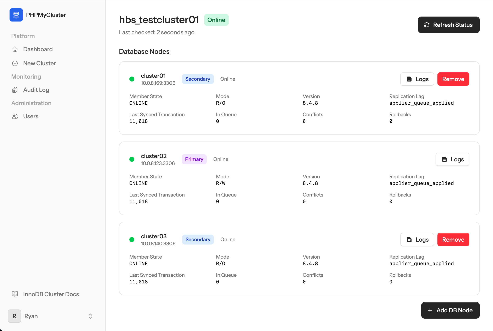
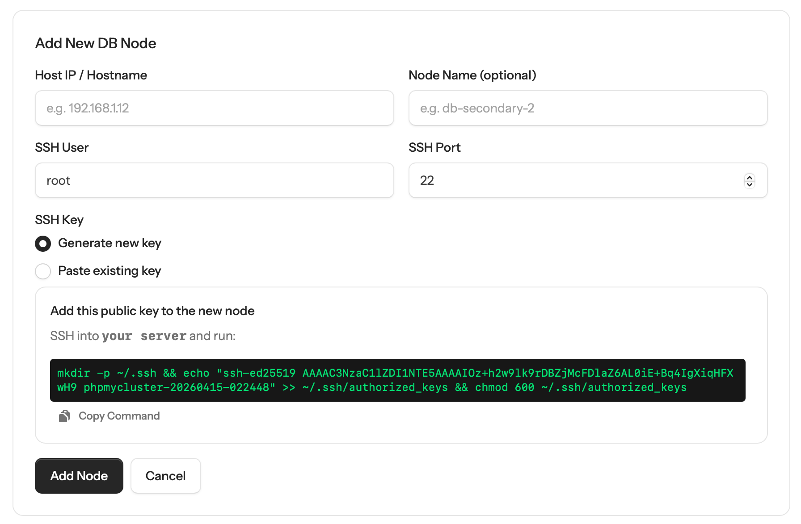
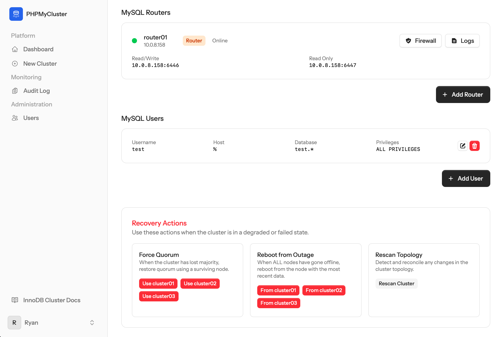

<p align="center">
  
</p>

<h1 align="center">PHPMyCluster</h1>

<p align="center">
  A web-based management tool for MySQL InnoDB Clusters.<br>
  Deploy, monitor, and manage highly available MySQL clusters from a single control panel — all over SSH.
</p>

Built with Laravel 13, Livewire 3, Flux UI, and Tailwind CSS.

## Screenshots

**Cluster Overview** — Real-time node health, replication status, and transaction sync at a glance.



**Add New Node** — Add a DB node by entering its SSH details. PHPMyCluster generates a key pair and provides the command to authorise it on the server.



**Routers, Users & Recovery** — Manage MySQL Routers, database users, and run recovery actions like force quorum and reboot from outage.



## Features

- **Cluster Provisioning** — Create InnoDB Clusters from scratch on fresh Debian/Ubuntu servers. Installs MySQL from the official APT repository, configures Group Replication, and bootstraps the cluster via SSH.
- **Health Monitoring** — Real-time cluster status, node health checks, replication lag tracking, and transaction sync indicators via `cluster.status({extended: 2})`.
- **Recovery Tools** — Force quorum, reboot from complete outage, rejoin lost nodes, and rescan topology using the MySQL Shell AdminAPI.
- **MySQL Router** — Bootstrap and manage MySQL Router on dedicated access nodes. Automatic read/write splitting and transparent failover.
- **Firewall Management** — Automatic UFW configuration with dynamic IP allowlists. Ports are opened only between cluster nodes.
- **Log Streaming** — Stream error logs, slow query logs, general logs, and systemd journals from any node in real time.
- **MySQL User Management** — Create, edit, and drop MySQL users with privilege presets. Create databases directly from the UI.
- **MySQL Auto-Tuning** — Detects server hardware (RAM, CPU cores, OS) during provisioning and generates an optimised `my.cnf` — buffer pool, redo log, connections, parallelism, and more are all scaled to the node's resources.
- **Async Operations** — Long-running tasks (provisioning, status refresh) run as queued jobs with real-time progress tracking.

## Requirements

- PHP 8.3+
- Composer
- Node.js 18+ and npm
- SQLite (used as the local application database)
- SSH access to your target servers (Debian/Ubuntu)

## Installation

### 1. Clone the repository

```bash
git clone https://github.com/your-org/phpmycluster.git
cd phpmycluster
```

### 2. Install dependencies

```bash
composer install
npm install
```

### 3. Configure environment

```bash
cp .env.example .env
php artisan key:generate
```

The default configuration uses SQLite, which requires no additional database setup. The `.env` defaults are:

```
DB_CONNECTION=sqlite
QUEUE_CONNECTION=database
CACHE_STORE=database
SESSION_DRIVER=database
```

### 4. Run migrations

```bash
php artisan migrate
```

### 5. Build frontend assets

```bash
npm run build
```

### 6. Create your admin user

Visit the application in your browser and register. The first registered user is automatically approved and granted admin privileges. Subsequent users require approval from the Users page.

## Running the Application

### Development

```bash
# Start the Laravel dev server
php artisan serve

# Start Vite for hot-reloading assets
npm run dev

# Start the queue worker (required for provisioning and status refresh)
php artisan queue:work --tries=3

# Optionally run multiple workers for parallel job processing
php artisan queue:work --tries=3 &
php artisan queue:work --tries=3 &
php artisan queue:work --tries=3 &
```

### Production

Use a process manager like Supervisor to keep the queue workers running. Example Supervisor config:

```ini
[program:phpmycluster-worker]
process_name=%(program_name)s_%(process_num)02d
command=php /path/to/phpmycluster/artisan queue:work --sleep=3 --tries=3 --max-time=1800
autostart=true
autorestart=true
stopasgroup=true
killasgroup=true
numprocs=4
redirect_stderr=true
stdout_logfile=/path/to/phpmycluster/storage/logs/worker.log
stopwaitsecs=1800
```

### Scheduled Tasks

The cluster status refresh runs every minute via the Laravel scheduler. Add this cron entry:

```
* * * * * cd /path/to/phpmycluster && php artisan schedule:run >> /dev/null 2>&1
```

## Architecture

PHPMyCluster runs on a **separate control node** and manages your cluster infrastructure over SSH. It does not run on any of the cluster nodes themselves.

```
┌─────────────────────┐
│    Control Node      │
│ PHPMyCluster + SQLite│
└──────────┬──────────┘
           │ SSH + mysqlsh
           │
    ┌──────┴──────┐
    │             │
┌───▼───┐  ┌─────▼─────┐  ┌───────────┐
│Primary│  │ Secondary  │  │ Secondary │
│  R/W  │  │    R/O     │  │    R/O    │
└───┬───┘  └─────┬──────┘  └─────┬─────┘
    │   Group Replication        │
    └────────────┬───────────────┘
                 │
          ┌──────▼──────┐
          │MySQL Router │
          │:6446 R/W    │
          │:6447 R/O    │
          └──────┬──────┘
                 │
          ┌──────▼──────┐
          │    Your     │
          │ Application │
          └─────────────┘
```

## Key Technologies

| Component | Technology |
|-----------|-----------|
| Backend | Laravel 13 |
| Frontend | Livewire 3 + Flux UI |
| Styling | Tailwind CSS v4 |
| Database | SQLite (app) / MySQL 8.4 (clusters) |
| SSH | phpseclib3 |
| Cluster Management | MySQL Shell AdminAPI (JS mode) |
| Queue | Laravel database driver |

## SSH Key Setup

PHPMyCluster connects to your servers via SSH. You can either:

1. **Generate a key pair** during cluster setup (the public key is displayed for you to add to each server's `~/.ssh/authorized_keys`)
2. **Provide an existing private key** during cluster setup

The SSH user must have `sudo` privileges on all target servers, as PHPMyCluster needs root access to install packages and configure MySQL.

## MySQL Shell

MySQL Shell (`mysqlsh`) is installed automatically on each cluster node during provisioning. PHPMyCluster connects to the nodes via SSH and executes `mysqlsh` commands remotely using the AdminAPI in JavaScript mode. There is no need to install MySQL Shell on the control node.

## Load Testing

PHPMyCluster ships with a built-in load testing tool that can create a sample schema, generate bulk data, and reset a target MySQL database. This is useful for stress-testing your InnoDB Cluster.

```bash
# Check current table sizes
php artisan loadtest status --host=127.0.0.1 --password=test

# Generate ~5 GB of test data (default)
php artisan loadtest seed --host=127.0.0.1 --password=test

# Generate a custom amount
php artisan loadtest seed --host=127.0.0.1 --password=test --size=10

# Drop all tables and recreate empty schema
php artisan loadtest reset --host=127.0.0.1 --password=test
```

### Options

| Option | Default | Description |
|--------|---------|-------------|
| `--host` | `127.0.0.1` | MySQL host |
| `--port` | `6446` | MySQL port (default is the Router R/W port) |
| `--database` | `test` | Target database |
| `--username` | `test` | MySQL username |
| `--password` | | MySQL password |
| `--size` | `5` | Target data size in GB (approximate) |
| `--batch-size` | `5000` | Rows per INSERT batch |

The `seed` action creates 9 tables (categories, suppliers, employees, customers, products, product_suppliers, orders, order_items, reviews) and populates them with realistic fake data. It is idempotent — re-running it will skip tables that are already at the target row count.

## License

This project is licensed under the GNU General Public License v3.0 — see the [LICENSE](LICENSE) file for details.
